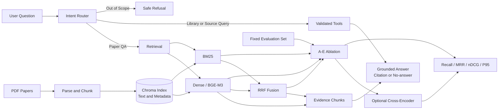

# 学术论文 RAG 助手 / Academic Paper RAG Assistant

面向学术论文问答和跨论文检索的 RAG + Tool Calling 系统，重点验证混合检索、
重排序以及效果与延迟之间的工程权衡。

当前示例知识库聚焦 SAR 图像生成论文。系统把 PDF 转换为可追溯的 Chunk，基于
检索证据生成带来源的回答，并在证据不足时拒答；同时提供可复现的检索消融与引用
评测，而不是只展示一次问答效果。

## 核心能力 / Why this project

- **可追溯的论文问答**：BGE-M3 + Chroma 完成语义检索，回答可定位到论文、PDF
  页码和稳定 Chunk ID。
- **可比较的检索链路**：实现 BM25、Dense + BM25 的 RRF 融合，以及本地
  Cross-Encoder Reranker，并用统一数据口径比较质量与延迟。
- **受控 Tool Calling**：对知识库查询和原文定位使用白名单工具、参数校验、调用预算
  与规则回退；RAG 回答支持引用和 no-answer。
- **可复现的评测方法**：固定 dev/test、Chunk-level graded qrels、A～E 消融，覆盖
  Recall@10、MRR@10、nDCG@10、引用指标和 P95 延迟。

## 关键结果

| 范围 | 已验证结果 |
|---|---:|
| 当前语料与索引 | 15 篇论文 / 218 页 / 2,142 Chunk |
| 固定评测集 | 100 题 / 213 条 Chunk-level graded qrels |
| Dense + Reranker vs. Dense | MRR@10 **+11.08 pp**；nDCG@10 相对 **+35.21%** |
| CPU P95 延迟 | 12.8896 s vs. 0.1057 s，约 **120×** |
| 自动化测试 | **137 / 137** 通过 |

这些结果来自参数冻结后的 50 题 test（40 题可回答、10 题 no-answer）。Reranker
改善了当前测试集的排序指标，但 CPU 延迟不满足交互预算；因此在线默认保留 Dense，
BM25/Hybrid 可在应用中切换，Reranker 保留在离线评测链路。完整结论见
[M7 最终消融报告](evaluation/m7_final_ablation_report.md)。

## 系统架构



在线应用支持 Dense、BM25 和 Hybrid/RRF，默认使用 Dense；Cross-Encoder 只用于
离线 D/E 配置。更完整的数据流、工具边界与模块职责见
[系统架构说明](docs/architecture.md)。

## 关键设计

### 1. 文档解析与可追溯 metadata

PyMuPDF 按页解析 PDF，文本切分后为每个 Chunk 保存文件名、Document ID、PDF
页码、Chunk 序号和稳定 Chunk ID。Chroma 保存向量、正文与相同 metadata，索引
Manifest 用于检查语料数量、切分参数和 Embedding 模型漂移。

### 2. Dense / Sparse / Hybrid Retrieval

- Dense：BGE-M3 Embedding + Chroma cosine distance。
- Sparse：对同一批 Chunks 构建确定性内存 BM25 索引。
- Hybrid：两路分别召回，按 Chunk ID 去重，再用 RRF 按排名融合；不直接相加量纲
  不同的 Dense distance 和 BM25 score。

### 3. Cross-Encoder Reranking

`BAAI/bge-reranker-v2-m3` 对 query-document pair 联合评分，再稳定排序候选。评测
保留 Dense、BM25、RRF 与 rerank score，便于定位每个组件对最终排名的影响。
该模型当前使用 CPU 离线运行，没有接入默认交互路径。

### 4. Grounded Answer、引用与 Tool Calling

RAG Prompt 只允许依据检索上下文作答，并要求返回来源编号；空检索和证据不足场景
支持 no-answer。Router 将请求约束为论文问答、知识库信息、来源定位或拒答四类，
模型输出必须经过枚举、参数和工具白名单校验，异常时回退到确定性规则。

### 5. Evaluation methodology

100 题按 25 legacy / 25 dev / 50 test 固定划分，参数只在 dev 上选择。213 条
Chunk-level qrels 支持分级相关性；冻结 test 同时报告排名质量、来源覆盖、拒答、
引用与逐题延迟。历史 25 题实验不与当前主 Benchmark 混用。

## 技术栈

| 层次 | 技术 |
|---|---|
| 应用与模型接入 | Python 3.10、Streamlit、OpenAI-compatible Chat Completions |
| 文档与索引 | PyMuPDF、LangChain Text Splitters、Chroma |
| 检索 | BGE-M3、rank-bm25、Reciprocal Rank Fusion |
| 重排序 | BGE Reranker v2 M3、Transformers、PyTorch |
| Agent 能力 | 结构化路由、白名单 Tool Calling、参数校验、规则回退 |
| 评测与测试 | Recall@k、MRR、nDCG、引用指标、P95、unittest |

## Quick Start

```bash
git clone https://github.com/foolishsanjiu/academic_paper_rag_assistant.git
cd academic_paper_rag_assistant
conda create -n academic-paper-rag python=3.10
conda activate academic-paper-rag
python -m pip install -r requirements.txt
```

复制 `.env.example` 为 `.env`，填写 `LLM_API_KEY`、`LLM_BASE_URL` 和
`LLM_MODEL`，然后启动：

```bash
python -m streamlit run app.py
```

PDF 与 Chroma 索引不随仓库分发。首次运行后，在页面上传 PDF 并重建向量库。
Windows 命令、模型下载、环境验证和索引说明见 [完整安装指南](docs/setup.md)。

## Evaluation / Benchmark

主结果来自 50 题冻结 test；Recall、MRR 和 nDCG 只聚合其中 40 道具有 qrels 的
可回答题。P95 来自同一次冻结运行的 50 个逐题样本，模型加载时间不计入。

| 配置 | 检索链路 | Recall@10 | MRR@10 | nDCG@10 | P95 latency |
|---|---|---:|---:|---:|---:|
| A | Dense | 0.4896 | 0.4093 | 0.3394 | 0.1057 s |
| B | BM25 | 0.2633 | 0.2490 | 0.2152 | **0.0061 s** |
| C | Dense + BM25 + RRF | 0.4037 | 0.4097 | 0.3191 | 0.1085 s |
| **D** | **Dense + Reranker** | **0.5350** | **0.5201** | **0.4589** | 12.8896 s |
| E | Dense + BM25 + RRF + Reranker | 0.5250 | 0.5074 | 0.4370 | 12.6863 s |

结果没有支持“组件越多越好”：C 没有在 test 上复现 dev 增益；D 的排序指标最高，
但 CPU P95 约为 A 的 120 倍，因此未替换默认 Dense。A/C/E 的端到端引用评测也都
没有通过预设的引用格式 100% 与可回答题引用覆盖 100% 门禁。人工复核仅由一名
标注者完成，相关结果只作为趋势，不作为系统可靠性结论。

评测数据校验与复现命令见 [Evaluation Guide](evaluation/README.md)，冻结协议和完整
限制见 [检索报告](evaluation/m7_retrieval_test_report.md)、
[生成与自动引用报告](evaluation/m7_generation_test_report.md)及
[最终消融报告](evaluation/m7_final_ablation_report.md)。

## 项目结构

```text
academic-paper-rag/
├── app.py                     # Streamlit 交互入口
├── agent_router.py            # 受控路由与 Tool Calling
├── rag_chain.py               # 检索、证据 Prompt 与回答生成
├── retriever.py               # Dense 检索与来源多样化
├── sparse_retriever.py        # BM25
├── hybrid_retriever.py        # RRF 融合
├── reranker.py                # Cross-Encoder 重排序
├── retrieval_pipeline.py      # 在线 Dense / BM25 / Hybrid 统一入口
├── tools/                     # 知识库查询与原文定位
├── evaluation/                # 数据集、qrels、评测脚本与冻结报告
├── docs/                      # 架构、安装与历史实验导航
└── tests/                     # 自动化测试与审计记录
```

## 详细文档

- [系统架构与安全边界](docs/architecture.md)
- [完整安装与环境配置](docs/setup.md)
- [评测数据、指标与复现命令](evaluation/README.md)
- [M7 最终消融报告](evaluation/m7_final_ablation_report.md)
- [旧 25 题评测说明与历史报告索引](docs/evaluation_legacy.md)
- [项目正确性审计](tests/project_comprehensive_audit_2026-09-01.md)

## 已知边界

- 当前语料规模和领域有限，结果不能外推为通用学术搜索性能。
- PDF 解析依赖文本层，不包含扫描件 OCR、图表视觉理解或复杂公式结构恢复。
- Chroma 是本地单用户存储；当前实现不面向高并发服务。
- Reranker 的质量收益来自当前冻结 test，CPU 延迟不满足交互预算。
- 人工回答与引用复核只有一名标注者，不能计算标注者间一致性。

## Acknowledgements

项目最初参考 [Datawhale LLM-Universe](https://github.com/datawhalechina/llm-universe)
学习 RAG 基础概念，随后围绕论文溯源、受控 Tool Calling、混合检索、重排序和冻结
评测进行了扩展。
