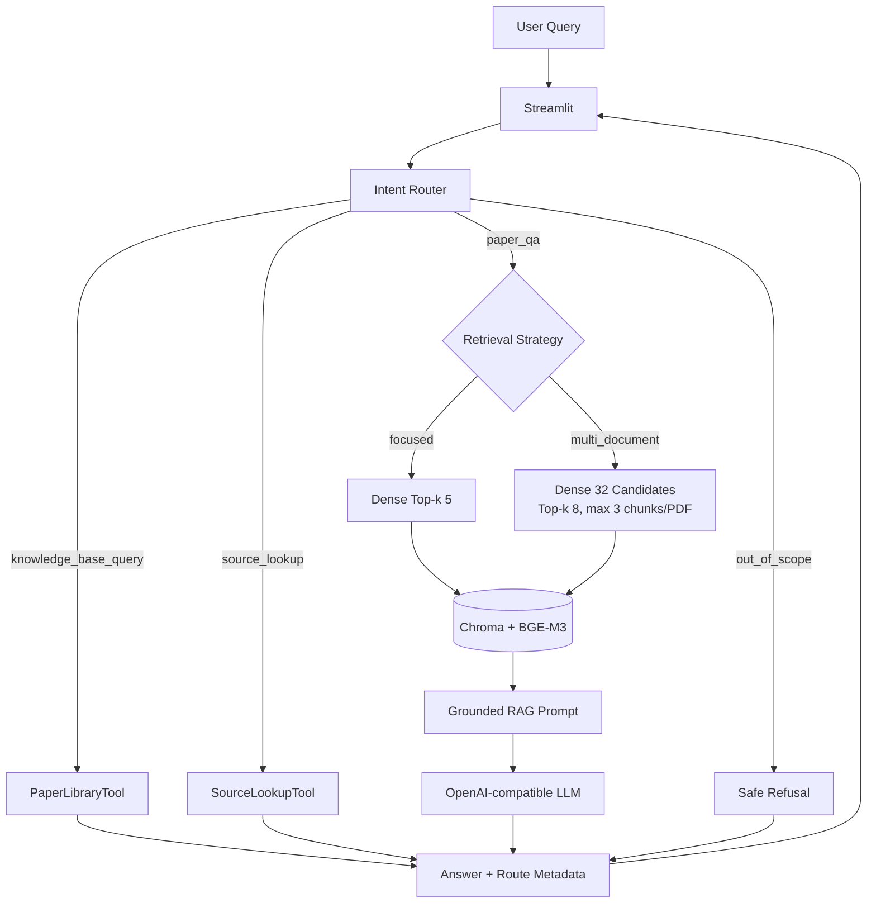
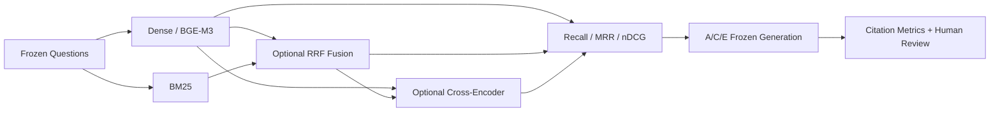
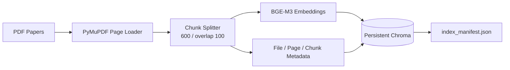

# Academic Paper RAG Assistant

面向学术论文的 RAG + Tool Calling 智能助手。当前知识库聚焦 GAN 与
Diffusion Model 驱动的 SAR 图像生成研究，可完成论文内容问答、跨论文比较、
知识库状态查询和 PDF 原文精确定位。

项目使用 PyMuPDF 解析 PDF，BGE-M3 生成向量，Chroma 持久化索引，兼容
OpenAI Chat Completions API 的模型负责意图路由、查询改写与基于证据的回答，
Streamlit 提供交互界面。

> 这不是只调用一次向量检索的演示项目：仓库包含可复现的 Dense/BM25/Hybrid/RRF/
> Cross-Encoder 消融、冻结评测集、Chunk 级 qrels、自动引用指标和人工引用复核。
> 最终实验没有为了展示而强行上线复杂方案，而是根据质量与 CPU 延迟共同选择默认
> Dense 路径。

## 项目亮点

- **完整应用链路**：论文上传、PDF 校验、Chunk 持久化、检索、生成、引用和拒答。
- **混合检索实验**：Dense、BM25、Reciprocal Rank Fusion 与 Cross-Encoder Reranker。
- **规范评测设计**：100 题固定数据集、213 条分级 qrels、dev/test 隔离和 A～E 消融。
- **多维指标**：Recall@k、MRR、nDCG、引用格式、引用覆盖、引用正确性和 P95 延迟。
- **工程可靠性**：索引 Manifest、Embedding 身份校验、稳定 Chunk ID、结构化异常和
  137 项自动化测试。
- **诚实的工程取舍**：Reranker 提升冻结 test 排序质量，但 CPU P95 延迟约为 Dense
  的 120 倍，因此只保留为离线实验能力。

## 技术栈

| 层次 | 技术 |
|---|---|
| 应用与模型接入 | Python 3.10、Streamlit、OpenAI-compatible Chat Completions |
| 文档处理 | PyMuPDF、LangChain Text Splitters |
| Dense Retrieval | BAAI/bge-m3、Chroma |
| Sparse / Hybrid | rank-bm25、Reciprocal Rank Fusion |
| Reranker | BAAI/bge-reranker-v2-m3、PyTorch、Transformers |
| 评测与质量保障 | Recall@k、MRR、nDCG、引用指标、`unittest`、Git |

## 功能

- 上传、校验 PDF，并重建本地向量库
- 保留文件名、PDF 页码、Document ID 和 Chunk ID
- 单论文 `focused` 检索与跨论文 `multi_document` 检索
- 基于检索证据生成回答，并展示论文、页码及 Chunk
- 知识库证据不足时拒答
- 多轮问题查询改写
- `PaperLibraryTool`：论文数量、列表、存在性、详情和索引状态
- `SourceLookupTool`：按 PDF 名称、页码或 Chunk ID 精确读取索引原文
- LLM JSON Intent Router，失败时使用确定性规则回退
- Tool 白名单、参数校验、结构化异常和最多 3 次调用限制
- 100 题 RAG 评测集、Chunk 级 qrels、Dense/BM25/Hybrid/Reranker 消融和 40 题 Router 评测集

## 系统架构



Hybrid 与 Reranker 采用独立的离线评测链路，避免未经性能门禁的复杂方案进入默认
交互路径：



索引构建链路：



更详细的模块说明见 [docs/architecture.md](docs/architecture.md)。

## 快速开始

### 1. 环境准备

推荐 Python 3.10 和 Conda：

```bash
conda create -n academic-paper-rag python=3.10
conda activate academic-paper-rag
python -m pip install -r requirements.txt
```

BGE-M3 首次加载需要从 Hugging Face 下载模型，之后可从本地缓存加载。

### 2. 配置模型 API

复制 `.env.example` 为 `.env`：

```env
LLM_API_KEY=your_api_key
LLM_BASE_URL=https://your-openai-compatible-endpoint/v1
LLM_MODEL=your_model_name
```

`LLM_BASE_URL` 可留空，此时使用 OpenAI SDK 默认地址。不要提交 `.env`。

验证环境变量是否完整（不调用 API）：

```bash
python config.py
```

如需验证模型连接，可执行下列交互脚本；它会向配置的模型发送请求，可能产生费用：

```bash
python llm_client.py
```

### 3. 启动应用

```bash
python -m streamlit run app.py
```

打开页面后上传 PDF，点击“保存所选 PDF / 重建向量库”。PDF 与 Chroma 索引属于
本地数据，已被 `.gitignore` 排除，不随仓库分发。

## 使用示例

| 请求 | 路由结果 |
|---|---|
| `What architecture does ATGAN use?` | focused RAG |
| `Compare ATGAN and DiffuSAR approaches.` | multi-document RAG |
| `当前知识库有多少篇论文？` | PaperLibraryTool |
| `查看 example.pdf 第 3 页原文` | SourceLookupTool |
| `帮我订机票` | out-of-scope 拒答 |

页面会显示本轮 Intent、检索策略或 Tool，并为 RAG 回答展示实际检索 Query、
参数、引用来源和全部召回 Chunk。

## 评测结果

当前评测语料为 15 篇英文 SAR 图像生成论文，共 218 页、2142 个 Chunk。
评测集含 100 题，固定划分为 25 道 legacy、25 道 dev 和 50 道 test；参数只能在
dev 上选择。下表是参数冻结后，在 50 题 test（40 题可回答、10 题 no-answer）上
一次执行得到的 A～E 检索结果：

| 配置 | Recall@10 | MRR@10 | nDCG@10 | 全文件命中 | P95 延迟 |
|---|---:|---:|---:|---:|---:|
| A Dense | 0.4896 | 0.4093 | 0.3394 | 0.700 | 0.1057 s |
| B BM25 | 0.2633 | 0.2490 | 0.2152 | 0.700 | **0.0061 s** |
| C Hybrid/RRF | 0.4037 | 0.4097 | 0.3191 | **0.725** | 0.1085 s |
| **D Dense + Reranker** | **0.5350** | **0.5201** | **0.4589** | 0.700 | 12.8896 s |
| E Hybrid/RRF + Reranker | 0.5250 | 0.5074 | 0.4370 | **0.725** | 12.6863 s |

D 相对 A 将 Recall 提升 4.54 个百分点、MRR 提升 11.08 个百分点、nDCG 相对
提升 35.21%，但 CPU P95 延迟约为 A 的 120 倍。C 没有在 test 上复现 dev 增益。
因此默认交互链路继续使用 Dense；Hybrid 与 Reranker 保留为可复现的离线实验能力。

### 端到端引用评测

A/C/E 在相同的 50 题 test 上完成冻结生成和自动引用评测：

| 配置 | 拒答正确率 | 引用格式合法率 | 可回答题有引用 | qrel precision | qrel recall |
|---|---:|---:|---:|---:|---:|
| A Dense | 0.60 | 0.90 | **0.975** | **0.250** | 0.414 |
| C Hybrid/RRF | 0.60 | **0.96** | **0.975** | 0.205 | 0.367 |
| E Hybrid/RRF + Reranker | **0.64** | **0.96** | 0.950 | 0.228 | **0.454** |

30 道可回答题的单人复核中，E 的回答均分为 1.433/2，Citation correctness 为
100%，高于 A 的 1.267/2 和 97.97%。但 E 相对 A 的配对符号检验 `p=0.180`，且
标签只有一名标注者并存在天花板效应，因此只能视为正向趋势，不能宣称稳定提升。

### Router 与质量保障

Router 评测集包含四类共 40 条中英文请求：

- 规则回退：40/40
- 真实 LLM JSON 路由：40/40
- 全仓自动化测试：137/137
- 当前 PDF、Document ID、Manifest 与 2142 个 Chroma Chunk 已完成一致性审计

详细依据见：

- [语料与索引审计](evaluation/corpus_audit.md)
- [M7 最终消融与人工引用结论](evaluation/m7_final_ablation_report.md)
- [冻结 test 检索报告](evaluation/m7_retrieval_test_report.md)
- [端到端生成与自动引用报告](evaluation/m7_generation_test_report.md)
- [项目全面正确性审计](tests/project_comprehensive_audit_2026-09-01.md)

## 复现评测

只评测 Retriever，不调用 LLM：

```bash
python evaluation/validate_dataset.py --qrels evaluation/qrels.json --require-qrels --check-index
python evaluation/evaluate_retrieval.py --method dense --split dev --top-k 10 --qrels evaluation/qrels.json
python evaluation/evaluate_retrieval.py --method bm25 --split dev --top-k 10 --qrels evaluation/qrels.json
python evaluation/evaluate_retrieval.py --method hybrid --split dev --top-k 10 --candidate-k 20 --rrf-k 60 --fusion-k 40 --qrels evaluation/qrels.json
```

本地 Reranker 模型准备好后，可复现 D/E；以下命令不会调用 LLM：

```bash
python evaluation/evaluate_retrieval.py --method dense_rerank --split dev --top-k 10 --reranker-model /path/to/bge-reranker-v2-m3 --reranker-candidate-k 40 --qrels evaluation/qrels.json
python evaluation/evaluate_retrieval.py --method hybrid_rerank --split dev --top-k 10 --candidate-k 20 --rrf-k 60 --fusion-k 40 --reranker-model /path/to/bge-reranker-v2-m3 --reranker-candidate-k 40 --qrels evaluation/qrels.json
```

运行完整 RAG 评测会调用配置的模型 API，可能产生费用：

```bash
python evaluation/evaluate.py --top-k 5 --temperature 0.2 --output evaluation/results/local_focused.json
python evaluation/evaluate.py --top-k 8 --candidate-k 32 --max-chunks-per-file 3 --output evaluation/results/local_multi_document.json
```

运行 Router 评测：

```bash
python evaluation/evaluate_router.py
```

真实 LLM Router 评测会调用配置的模型 API，可能产生费用：

```bash
python evaluation/evaluate_router.py --use-llm
```

运行测试：

```bash
python -m unittest discover -s tests -v
```

## 项目结构

```text
academic-paper-rag/
├── app.py                    # Streamlit 界面与 Agent 集成
├── agent_router.py           # Intent Router、白名单分发与调用预算
├── agent_response.py         # Tool JSON 到聊天响应的适配
├── rag_chain.py              # 查询改写、检索、Prompt 和生成
├── retriever.py              # focused / multi_document 检索
├── sparse_retriever.py       # 确定性 BM25 分词、内存索引与 Top-N
├── hybrid_retriever.py       # Dense/BM25 候选标准化、去重与 RRF
├── reranker.py               # 本地 Cross-Encoder 批量评分与稳定重排
├── tools/
│   ├── paper_library.py      # 知识库信息查询
│   └── source_lookup.py      # 页码/Chunk 精确定位
├── document_loader.py        # PDF 逐页解析与 metadata
├── text_splitter.py          # Chunk 切分与持久 ID
├── vector_store.py           # BGE-M3 与 Chroma
├── knowledge_base.py         # PDF 管理与校验
├── index_manifest.py         # 索引构建清单
├── llm_client.py             # OpenAI-compatible LLM 客户端
├── config.py                 # 集中配置
├── evaluation/               # 数据集、脚本、实验报告和结果
├── tests/                    # 单元、路由、失败和全流程测试记录
├── data/papers/              # 本地 PDF，不提交
└── chroma_db/                # 本地向量库，不提交
```

## 已知限制

- Hybrid/RRF 和 Reranker 目前只接入离线评测，尚未切换 RAGChain 和 Streamlit；
  Reranker 虽在冻结 test 上取得最佳排序指标，但 CPU P95 约为 12.7～12.9 秒。
- PDF 解析以文本层为主，不处理扫描件 OCR、图表视觉理解和复杂公式结构。
- SourceLookupTool 需要明确的 PDF 文件名；缺少来源信息时不会猜测文件。
- Chroma 为本地单用户存储；重建索引期间不适合并发读写。
- 人工答案与引用只有一名标注者，样本较小且存在标签天花板效应。
- 未提供用户登录、远程部署、FastAPI 或多 Agent 系统。

## Acknowledgements

项目最初参考 [Datawhale LLM-Universe](https://github.com/datawhalechina/llm-universe)
学习 RAG 基础概念与实现思路，随后针对学术论文场景进行了独立二次开发。

本项目新增和深化的部分包括 PDF 上传与质量校验、页码/Chunk metadata、持久化
Chroma 索引、拒答与引用、专业评测集、Dense/BM25/Hybrid/Reranker 消融、
Intent Router、PaperLibraryTool、SourceLookupTool、安全 Fallback、日志、自动化测试
与 Streamlit Agent 界面。
