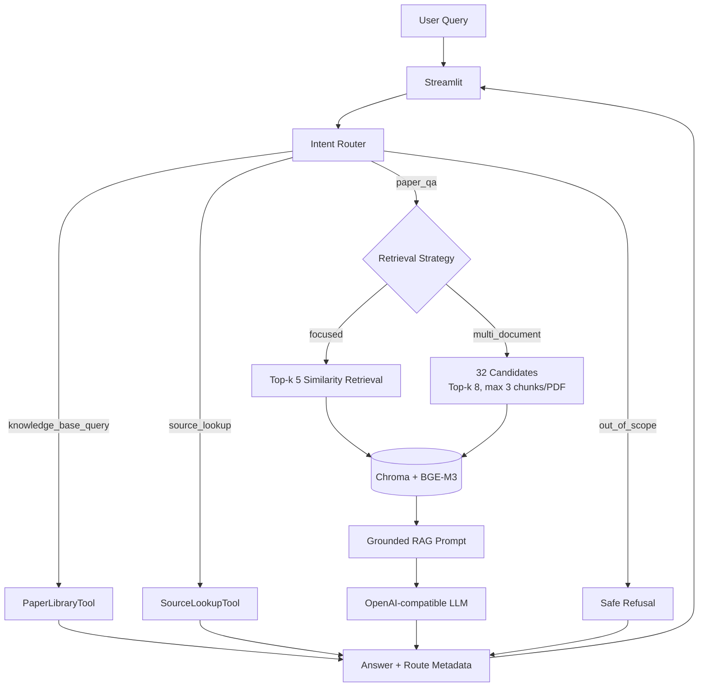
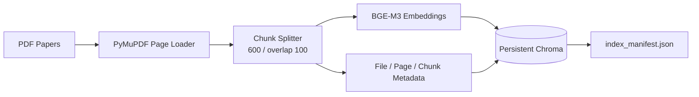

# Academic Paper RAG Assistant

面向学术论文的 RAG + Tool Calling 智能助手。当前知识库聚焦 GAN 与
Diffusion Model 驱动的 SAR 图像生成研究，可完成论文内容问答、跨论文比较、
知识库状态查询和 PDF 原文精确定位。

项目使用 PyMuPDF 解析 PDF，BGE-M3 生成向量，Chroma 持久化索引，兼容
OpenAI Chat Completions API 的模型负责意图路由、查询改写与基于证据的回答，
Streamlit 提供交互界面。

## 功能

- 上传、校验 PDF，并重建本地向量库
- 保留文件名、PDF 页码、Document ID 和 Chunk ID
- 单论文 `focused` 检索与跨论文 `multi_document` 检索
- 基于检索证据生成回答，并展示论文、页码及 Chunk
- 知识库证据不足时拒答
- 多轮问题查询改写
- `PaperLibraryTool`：论文数量、列表、存在性、详情和索引状态
- `SourceLookupTool`：按 PDF 名称、页码或 Chunk ID 精确读取索引原文
- LLM JSON Intent Router，失败时使用确定性规则回退
- Tool 白名单、参数校验、结构化异常和最多 3 次调用限制
- 25 题 RAG 评测集、检索参数实验和 40 题 Router 评测集

## 架构



索引构建链路：



更详细的模块说明见 [docs/architecture.md](docs/architecture.md)。

## 快速开始

### 1. 环境准备

推荐 Python 3.10 和 Conda：

```bash
conda create -n academic-paper-rag python=3.10
conda activate academic-paper-rag
python -m pip install -r requirements.txt
```

BGE-M3 首次加载需要从 Hugging Face 下载模型，之后可从本地缓存加载。

### 2. 配置模型 API

复制 `.env.example` 为 `.env`：

```env
LLM_API_KEY=your_api_key
LLM_BASE_URL=https://your-openai-compatible-endpoint/v1
LLM_MODEL=your_model_name
```

`LLM_BASE_URL` 可留空，此时使用 OpenAI SDK 默认地址。不要提交 `.env`。

验证配置：

```bash
python config.py
python llm_client.py
```

### 3. 启动应用

```bash
python -m streamlit run app.py
```

打开页面后上传 PDF，点击“保存 PDF 并重建向量库”。PDF 与 Chroma 索引属于
本地数据，已被 `.gitignore` 排除，不随仓库分发。

## 使用示例

| 请求 | 路由结果 |
|---|---|
| `What architecture does ATGAN use?` | focused RAG |
| `Compare ATGAN and DiffuSAR approaches.` | multi-document RAG |
| `当前知识库有多少篇论文？` | PaperLibraryTool |
| `查看 example.pdf 第 3 页原文` | SourceLookupTool |
| `帮我订机票` | out-of-scope 拒答 |

页面会显示本轮 Intent、检索策略或 Tool，并为 RAG 回答展示实际检索 Query、
参数、引用来源和全部召回 Chunk。

## 评测结果

当前评测语料为 15 篇英文 SAR 图像生成论文，共 218 页、2142 个 Chunk。
评测集含 25 题：10 道事实题、5 道比较题、5 道跨文档题和 5 道无答案题。

| 指标 | focused baseline（Top-k 5） | multi-document（Top-k 8） |
|---|---:|---:|
| 任一期望论文召回 | 100% | 100% |
| 全部期望论文召回 | 65% | 90% |
| 任一期望页召回 | 85% | 90% |
| 全部期望页召回 | 50% | 55% |
| 拒答行为正确率 | 84% | 96% |
| 人工答案评分 | 39/50 | 43/50 |
| 平均延迟 | 4.12 s | 6.78 s |

跨文档策略使用 32 个候选、最终 Top-k 8、每篇论文最多 3 个 Chunk。实验表明
它提升多论文证据覆盖，但延迟增加且会让个别事实题退化，因此 Router 只在比较或
跨论文综合问题中启用该策略。

Router 评测集包含四类共 40 条中英文请求：

- 规则回退：40/40
- 真实 LLM JSON 路由：40/40

详细依据见：

- [语料与索引审计](evaluation/corpus_audit.md)
- [优化 RAG 评测](evaluation/optimized_rag_report.md)
- [Top-k 实验](evaluation/top_k_report.md)
- [来源多样化实验](evaluation/diversified_retrieval_report.md)
- [全流程测试记录](tests/full_flow_test_report.md)

## 复现评测

只评测 Retriever，不调用 LLM：

```bash
python evaluation/evaluate_retrieval.py
```

运行完整 RAG 评测：

```bash
python evaluation/evaluate.py --top-k 5 --temperature 0.2 --output evaluation/results/local_focused.json
python evaluation/evaluate.py --top-k 8 --candidate-k 32 --max-chunks-per-file 3 --output evaluation/results/local_multi_document.json
```

运行 Router 评测：

```bash
python evaluation/evaluate_router.py
python evaluation/evaluate_router.py --use-llm
```

运行测试：

```bash
python -m unittest discover -s tests -v
```

## 项目结构

```text
academic-paper-rag/
├── app.py                    # Streamlit 界面与 Agent 集成
├── agent_router.py           # Intent Router、白名单分发与调用预算
├── agent_response.py         # Tool JSON 到聊天响应的适配
├── rag_chain.py              # 查询改写、检索、Prompt 和生成
├── retriever.py              # focused / multi_document 检索
├── tools/
│   ├── paper_library.py      # 知识库信息查询
│   └── source_lookup.py      # 页码/Chunk 精确定位
├── document_loader.py        # PDF 逐页解析与 metadata
├── text_splitter.py          # Chunk 切分与持久 ID
├── vector_store.py           # BGE-M3 与 Chroma
├── knowledge_base.py         # PDF 管理与校验
├── index_manifest.py         # 索引构建清单
├── llm_client.py             # OpenAI-compatible LLM 客户端
├── config.py                 # 集中配置
├── evaluation/               # 数据集、脚本、实验报告和结果
├── tests/                    # 单元、路由、失败和全流程测试记录
├── data/papers/              # 本地 PDF，不提交
└── chroma_db/                # 本地向量库，不提交
```

## 已知限制

- 当前基准语料是英文 SAR 图像生成论文，尚未专门评测中英跨语言检索。
- PDF 解析以文本层为主，不处理扫描件 OCR、图表视觉理解和复杂公式结构。
- SourceLookupTool 需要明确的 PDF 文件名；缺少来源信息时不会猜测文件。
- Chroma 为本地单用户存储；重建索引期间不适合并发读写。
- 人工答案评分规模较小，不能替代更大规模领域专家评测。
- 未提供用户登录、远程部署、FastAPI 或多 Agent 系统。

## Acknowledgements

项目最初参考 [Datawhale LLM-Universe](https://github.com/datawhalechina/llm-universe)
学习 RAG 基础概念与实现思路，随后针对学术论文场景进行了独立二次开发。

本项目新增和深化的部分包括 PDF 上传与质量校验、页码/Chunk metadata、持久化
Chroma 索引、拒答与引用、专业评测集、参数实验、双检索策略、Intent Router、
PaperLibraryTool、SourceLookupTool、安全 Fallback、日志与 Streamlit Agent 界面。
