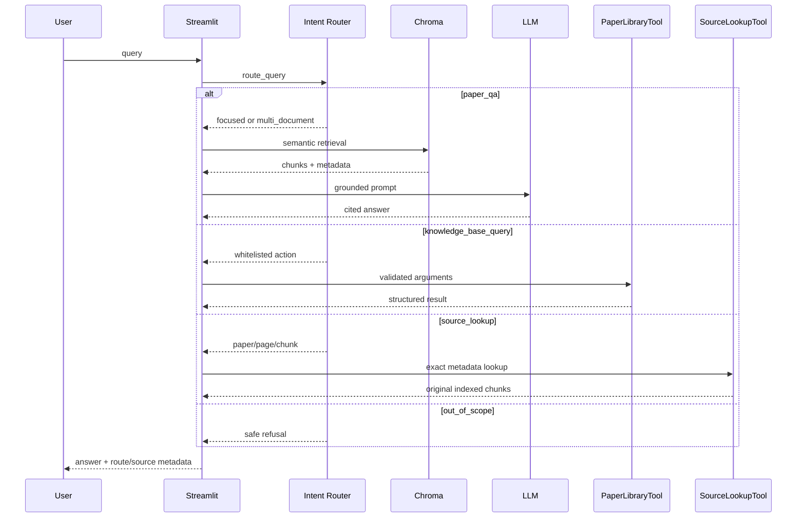

# Project Architecture

## Runtime flow



The LLM Router must return a JSON object. `validate_llm_decision` converts that
untrusted output into enums and whitelisted arguments; invalid JSON, API errors,
or unsupported values fall back to deterministic routing rules. A model-provided
function name is never executed.

## Retrieval strategies

| Strategy | Intended query | Final Top-k | Candidate pool | Per-file cap |
|---|---|---:|---:|---:|
| `focused` | Single-paper or focused factual question | 5 | 5 | none |
| `multi_document` | Comparison or cross-paper synthesis | 8 | 32 | 3 |

The split is based on measured retrieval and answer-quality tradeoffs. The
multi-document strategy improves all-expected-file recall but adds latency and
can remove useful local evidence from a focused factual question.

These two strategies describe the default interactive application. The
Hybrid/RRF and Cross-Encoder configurations below are implemented in the
unified retrieval pipeline and used by the reproducible offline evaluation,
but are deliberately not enabled in the Streamlit path because they did not
pass the frozen quality-and-latency release gates.

## Offline retrieval and evaluation flow

```mermaid
flowchart LR
    Q[Frozen questions] --> D[Dense / BGE-M3]
    Q --> B[BM25]
    D --> RRF[Optional RRF fusion]
    B --> RRF
    D --> DR[Dense candidates]
    DR --> CE[Optional BGE Cross-Encoder]
    RRF --> CE
    D --> M[Recall@k / MRR / nDCG]
    B --> M
    RRF --> M
    CE --> M
    M --> G[A/C/E frozen generation]
    G --> C[Automatic and human citation evaluation]
```

The frozen A-E ablation separates each component's contribution:

| ID | Retrieval configuration |
|---|---|
| A | Dense |
| B | BM25 |
| C | Dense + BM25, fused with RRF |
| D | Dense candidates + Cross-Encoder Reranker |
| E | Hybrid/RRF candidates + Cross-Encoder Reranker |

Dense and BM25 scores are never added directly. RRF combines branch ranks by
`sum(1 / (rrf_k + rank))`, deduplicates candidates by persistent `chunk_id`,
and keeps the original branch ranks and scores for diagnostics. The Reranker
jointly scores each query-candidate pair after first-stage retrieval.

On the 50-question frozen test, D produced the best ranked-retrieval metrics,
but its CPU P95 was 12.8896 seconds versus 0.1057 seconds for A. C did not
reproduce its development-set gain. The application therefore keeps Dense as
the default, while Hybrid and Reranker remain fully implemented offline
experiment options. See
[`evaluation/m7_final_ablation_report.md`](../evaluation/m7_final_ablation_report.md)
for the final benchmark and its statistical limitations.

## Index data model

PDFs are loaded one page at a time and then split into chunks. Important Chroma
metadata includes:

- `file_name`
- `document_id`
- `document_type`
- `page_number` and `page_label`
- `chunk_index`
- `chunk_id`

`SourceLookupTool` reads these fields directly with `Chroma.get`; it does not
run semantic retrieval or load an embedding model.

## Module responsibilities

| Module | Responsibility |
|---|---|
| `app.py` | Streamlit state, upload/rebuild controls and rendering |
| `agent_router.py` | JSON routing, rule fallback, whitelist dispatch, call budget |
| `agent_response.py` | Convert structured Tool results for the UI |
| `rag_chain.py` | Query rewriting, context construction, grounded answer generation |
| `retriever.py` | Similarity retrieval and source diversification |
| `sparse_retriever.py` | Deterministic BM25 tokenization, indexing and ranking |
| `hybrid_retriever.py` | Dense/BM25 normalization, deduplication and RRF |
| `reranker.py` | Local Cross-Encoder scoring and deterministic reranking |
| `retrieval_pipeline.py` | Unified Dense, BM25, Hybrid and reranked execution |
| `tools/paper_library.py` | Deterministic knowledge-base metadata queries |
| `tools/source_lookup.py` | Exact PDF page/Chunk lookup |
| `knowledge_base.py` | PDF discovery, validation and upload storage |
| `document_loader.py` | Page-level parsing and document metadata |
| `text_splitter.py` | Chunking and stable Chunk IDs |
| `vector_store.py` | BGE-M3 embeddings and persistent Chroma operations |
| `index_manifest.py` | Record and validate index build parameters |
| `llm_client.py` | OpenAI-compatible chat, JSON and streaming calls |
| `config.py` | Paths and runtime defaults |
| `evaluation/` | Frozen datasets, qrels, metrics, ablations and citation review |

## Safety and failure boundaries

- The only executable tools are `paper_library` and `source_lookup`.
- Tool actions and retrieval strategies are enums, not arbitrary strings.
- A per-request `ToolCallBudget` allows at most three calls.
- Parameter errors and unavailable data return structured errors.
- Unexpected Tool exceptions are logged and converted to safe responses.
- File deletion and Shell execution are not exposed as tools.
- Out-of-scope or prompt-injection-like requests are refused.

## Relationship to LLM-Universe

The project began as a learning exercise informed by Datawhale LLM-Universe.
Project-specific development includes PDF validation and upload, persistent
source metadata, citation rendering, refusal evaluation, parameter experiments,
named retrieval strategies, both domain tools, validated routing, failure
guards, observability, and the integrated Streamlit Agent interface.
